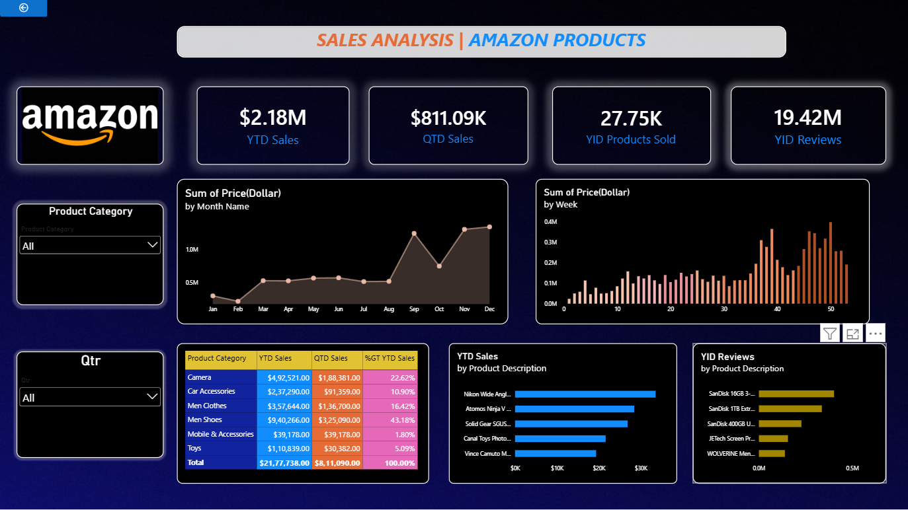

# 📊 Amazon Products Sales Analysis – Power BI Dashboard

## 📌 Project Overview

This project is an interactive Power BI dashboard created to analyze Amazon product sales performance.

The dashboard provides a clear view of sales, products sold, reviews, product categories, and sales trends over time.

## 🛠️ Tools & Technologies Used

- Power BI
- Data Analysis
- Data Visualization
- Excel / CSV Dataset

## 📈 Key Performance Indicators (KPIs)

The dashboard displays the following key metrics:

- **YTD Sales:** $2.18M
- **QTD Sales:** $811.09K
- **YTD Products Sold:** 27.75K
- **YTD Reviews:** 19.42M

## 📊 Dashboard Features

- Sales analysis by product category
- YTD Sales and QTD Sales analysis
- Product sales by product description
- YTD Reviews by product description
- Monthly sales trend analysis
- Weekly sales trend analysis
- Product category filter
- Quarter filter
- Interactive Power BI visuals

## 🔍 Analysis Performed

The dashboard helps analyze:

- Overall sales performance
- Monthly and weekly sales trends
- Product category performance
- Top products based on sales
- Products receiving the highest number of reviews
- Comparison of sales across different categories
- Quarterly sales performance

## 🎯 Project Objective

The main objective of this project is to transform raw Amazon product sales data into an interactive and easy-to-understand Power BI dashboard.

This dashboard helps users identify sales trends, understand product performance, and explore business data through interactive visualizations.

## 🖼️ Dashboard Preview

## 💡 Key Insights

The dashboard provides insights into sales performance, product categories, product-level sales, and customer reviews.

Interactive filters allow users to explore the data based on **product category** and **quarter**.

## 👩‍💻 Created By

**Shirisha Bashamoni**

### 📂 Project Type
Power BI Data Analytics Project
t
